# Visual map — what the project chain teaches

Diagrams render directly on GitHub. If you're reading this in a plain text editor, the Mermaid blocks are still readable as structured text.

---

## 1. The dependency graph

Projects aren't independent. One artefact — the ALU — threads through five of them.

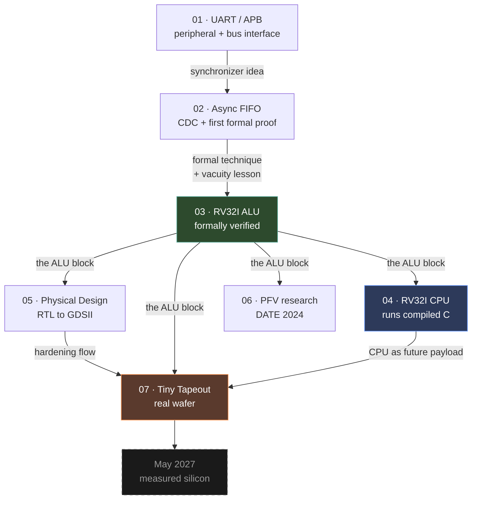

**Read this as:** Project 03's ALU is the spine. It gets integrated (04), hardened (05), researched (06) and fabricated (07). Everything else is either a prerequisite skill or a consequence of it.

---

## 2. The abstraction ladder

Each project sits at a different level of "how real is this?"

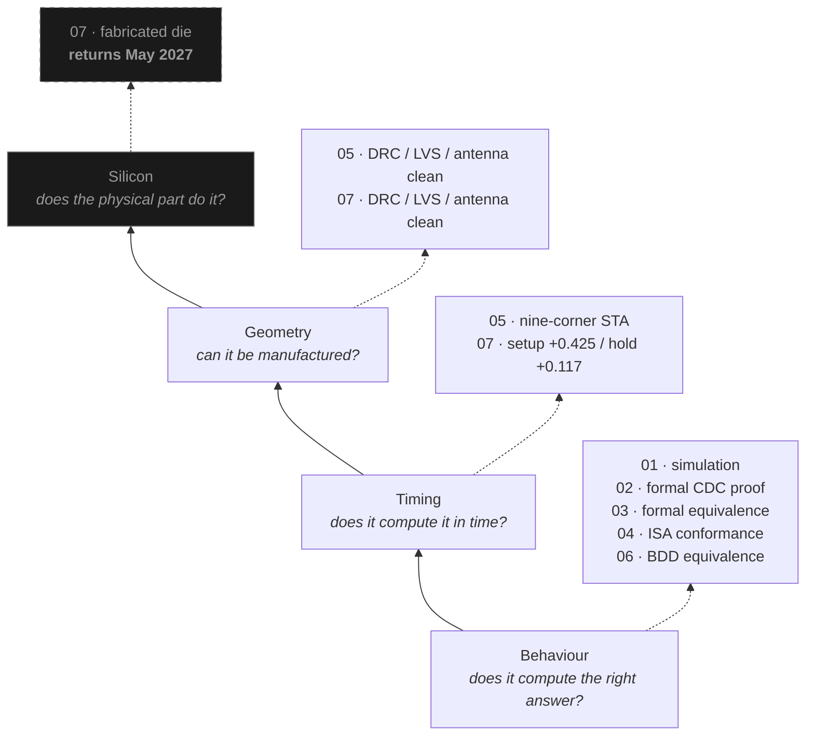

**The point:** most portfolios stop at the bottom layer. This one reaches the third and has the fourth scheduled. Each layer can pass while the one above fails — a design can be functionally perfect and fail timing, or meet timing and violate DRC.

---

## 3. The verification ladder — the actual intellectual arc

This is the most important diagram here. It's the story of *how confidence was earned*, and each rung was learned by being burned on the one below.

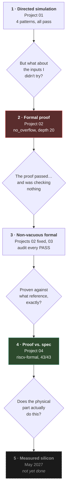

**Each arrow is a question the previous rung couldn't answer.** That's what makes it a ladder rather than a list.

---

## 4. Vacuity — three times, three disguises

The recurring failure. Same root cause every time.

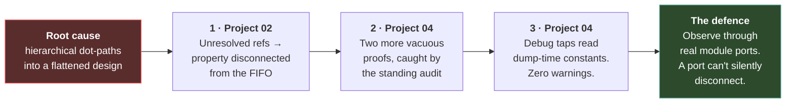

The third one is the most instructive: the defence was already written in this project's own `pc_bind.sv` header comment — *"no dot-paths, avoiding the vacuous-proof issue"* — and the same mistake was still made from the wrapper side. Knowing a lesson and having it structurally enforced are different things.

---

## 5. Why riscv-formal found what nothing else could

The single strongest result in the portfolio, drawn as a comparison.

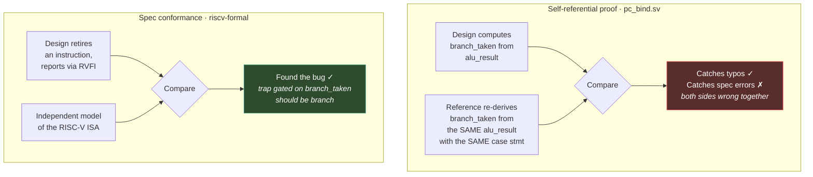

---

## 6. The bug itself, as a state walk

Worth being able to draw this on a whiteboard.

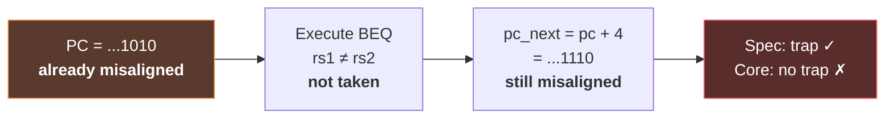

**Why every other method missed it:**

| Method | Why it missed |
|---|---|
| Compiled C bubble-sort | Real code never runs from a misaligned PC |
| Directed tests | Nobody writes a test that starts misaligned *and* uses a not-taken branch |
| `pc_bind.sv` proof | Re-derives the same condition from the same signals |
| Gate-level sim | Same stimulus as RTL — same blind spot |
| riscv-formal | Solver picks any legal PC, including misaligned ones ✓ |

---

## 7. Project 05 vs Project 07 — what a clock tree costs

The same RTL, hardened twice under different constraints. This is a controlled experiment, which is rare in a portfolio.

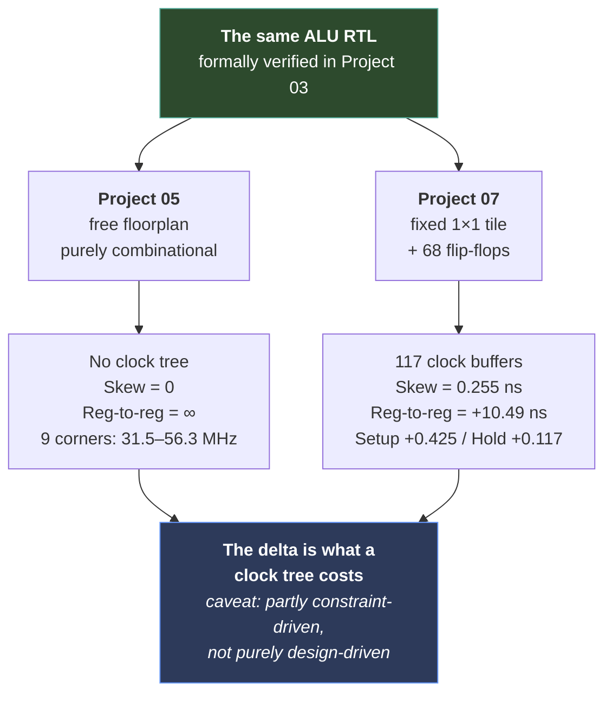

The caveat in that last box matters. Flagging that part of the difference comes from the clock *constraint* rather than the clock *tree* is what makes the rest of the comparison credible. Isolating it would mean re-running Project 05 at 25 ns on a fixed die.

---

## 8. The Tiny Tapeout interface problem

101 signals, 24 pins, and the reasoning that picked the solution.

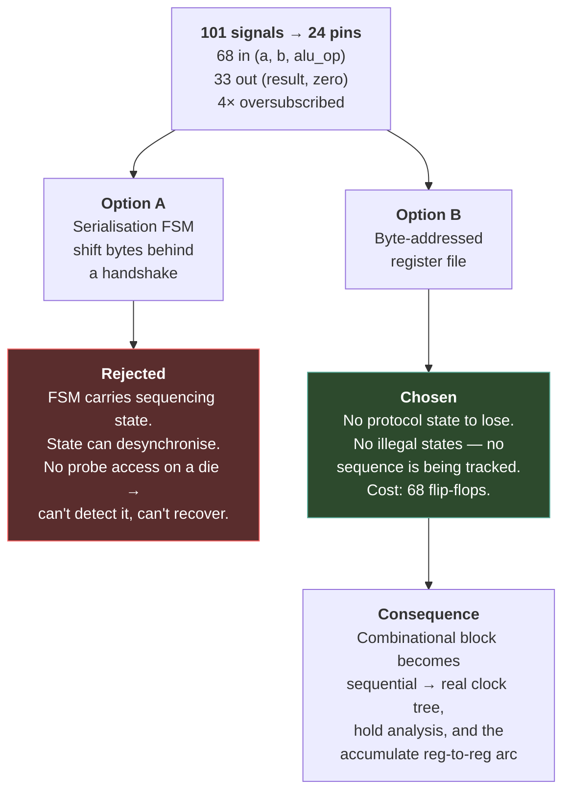

---

## 9. The green-checkmark trap

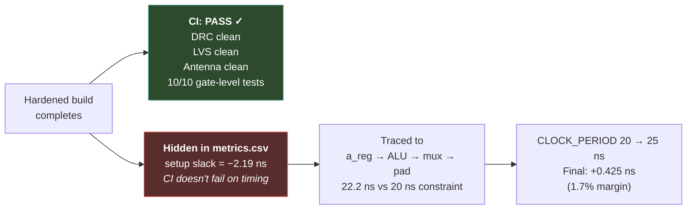

**The transferable lesson:** know what your CI actually checks. A passing pipeline is evidence about the checks that ran, not about the design.

---

## 10. Skills accumulated, by project

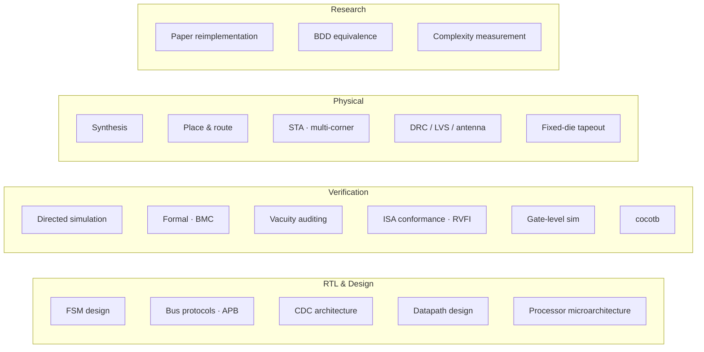

| Project | Adds |
|---|---|
| 01 | FSM design, APB, oversampling, FPGA flow, first synchronizer |
| 02 | CDC architecture, Gray code, formal BMC, **vacuity** |
| 03 | Exhaustive formal equivalence on a datapath |
| 04 | Integration, cross-toolchain build, RVFI, **ISA conformance** |
| 05 | Full RTL-to-GDSII, multi-corner STA, physical verification |
| 06 | Research reimplementation, BDD ordering, complexity measurement |
| 07 | Fixed-die constraints, clock tree, cocotb, **auditing CI** |

---

## 11. What's finished and what isn't

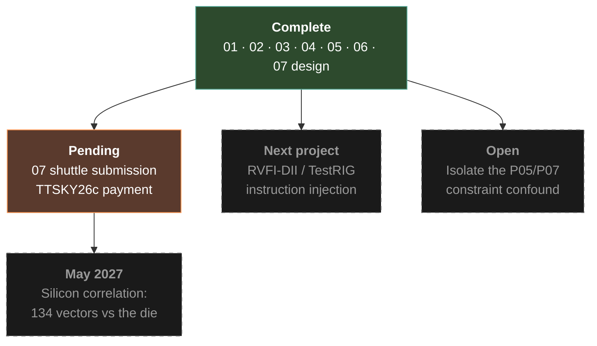

---

## The whole thing in one sentence

**One arithmetic block — written once, proven against an independent model, integrated into a processor that runs compiled C, proven again against the ISA where a real bug surfaced that neither simulation nor self-referential proof could see, hardened to routed silicon twice under different physical constraints, studied as the subject of a research reimplementation that corrected two of the original paper's claims, and sent to a shuttle that returns it as a fabricated die.**

Plus three separate occasions where verification appeared to succeed while checking nothing — each caught, and each one changing how the next proof was written.
